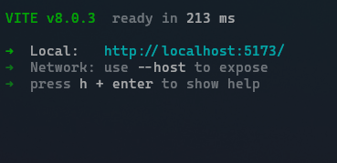
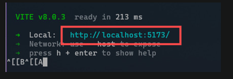

# Onda Finance - App Bancário Simulado
# teste_Jobz_front

## Descrição
Aplicativo web simulando um app bancário simples, com foco em UX, organização e boas práticas.

---

## Rodar o projeto
Obs: utilizar Node.js versão 24, pois algumas bibliotecas/dependências podem não funcionar corretamente em versões superiores.

1. Clone o repositório:
```bash
git clone https://github.com/Otavioalv/teste_Jobz_front.git
```

2. Entre na pasta
```bash
cd teste_Jobz_front/onda_finance
```

3. Instalar dependencias
```bash
npm install
```

4. Rode o projeto
```bash
npm run dev
```

5. Teste o projeto 
```bash
npm run test
```

6. Acessar o projeto
Na maioria dos cados, ao rodar
```bash
npm run dev
```
localmente, basta copiar a URL abaixo e colar em um navegador para acessar a aplicação:
```
http://localhost:5173/
```


Em alguns casos, o Vite pode não identificar corretamente a porta 5173 e escolher outra, como 5174 ou 5175. Nesse caso, ao iniciar o projeto, o terminal mostrará algo parecido com a imagem abaixo:



Copie o link indicado em vermelho na imagem (ou o equivalente que aparecer no seu terminal) e cole no navegador:




## Tela de Formulario de login
Para acessar o sistema, utilize um destes usuários:
```js
Email: otavio@gmail.com
Senha: Otavio@padrao12
```
```js
Email: tiago@gmail.com
Senha: Tiago@padrao12
```
```js
Email: juliana@gmail.com
Senha: Juliana@padrao12
```

---
## Stacks utilizadas

- [x] React + TypeScript
- [x] Vite
- [x] Tailwind + CVA
- [x] shadcn/ui + Radix
- [x] React Router
- [x] React Query
- [x] Zustand
- [x] React Hook Form + Zod
- [x] Axios
- [x] Vitest

---

## Funcionalidades Aplicadas

- [x] Login (mock)
    - [x] Tela simples
    - [x] Persistência de sessão
    - [x] Criar mock

- [x] Dashboard
    - [x] Exibir saldo
    - [x] Listar transações (mock)
    - [x] Criar mock

- [x] Transferência
    - [x] Formulário com validação
    - [x] Atualizar saldo em tela
    - [X] Criar mock


## Decisões Técnicas Adotadas
* Estrutura do projeto
O projeto foi organizado seguindo o conceito de Domain-Driven Design (DDD), também conhecido como Feature-Based Structure, que organiza os arquivos pelo contexto de negócio. Cada feature possui suas próprias pastas de components, hooks, services, types e testes, para ter uma escalabilidade e manutenção fácil.

* Mock de API
Como o projeto não possui uma API real, foram utilizados dados mock para simular respostas. Cada service possui uma função que simula chamadas assíncronas com setTimeout e validações próprias. Para ilustrar como uma conexão real seria feita, foram deixados exemplos comentados de chamadas usando Axios, centralizados em /src/services/financeAPI/index.ts.

* Gerenciamento de Estado
Zustand: utilizado para gerenciar autenticação e persistência de login (via localStorage).
React Query: responsável por gerenciar dados do dashboard, saldo e histórico de transações, com invalidação de queries após transações

* Validação de Formulários
Os formulários utilizam React Hook Form em conjunto com Zod para validação de campos

* UI e Estilo
Componentes: Foram utilizados na maior parte da aplicação shadcn/ui + Radix como base de componentes mais complexos
Estilização: Tailwind CSS + CVA, para o estilo

* Testes
Ferramenta: Vitest.
Cobertura mínima: testado o fluxo de login, incluindo casos de sucesso e falha

* Fluxos e Atualizações de Dados
Ao realizar uma transação, os dados do React Query relacionados ao saldo e ao histórico de transações são automaticamente invalidados e recarregados


## Segurança
Atualmente, a maior vulnerabilidade desta aplicação está no sistema de login. O uso do Zustand para armazenar o token de autenticação não garante uma proteção robusta, pois qualquer pessoa com acesso ao navegador pode visualizar ou alterar o token armazenado no localStorage. Em um cenário real, usando JWT, o ideal seria salvar o token em um cookie HTTP-only no lado do servidor, garantindo que apenas o backend possa criar, ler e deletar o token.

Outro ponto importante é a validação feita apenas com Zod nos formulários. Essa validação atua mais como uma camada visual e de experiência do usuário, mas não impede que alguém com conhecimento técnico manipule os valores diretamente no navegador. Por isso, para proteger dados sensíveis, como senhas ou valores de transações, é fundamental que o backend faça validações adicionais, garantindo que usuários não consigam burlar regras apenas alterando o frontend.

No caso de transações financeiras, qualquer manipulação do formulário poderia resultar em valores incorretos. Em um ambiente real, todas as requisições devem ser feitas via HTTPS.
Algumas dessas descrições podem se aproximar de riscos relacionados à engenharia reversa.


## Melhorias Futuras
Deixei o arquivo de configuração de conexão com a API via Axios pronto, o que facilitaria a implementação de um backend real com os devidos endpoints para login, saldo, transações e transferências. Seria interessante adicionar paginação no histórico de transações para que o usuário consiga navegar facilmente por toda a movimentação, evitando que apenas uma parte seja exibida. Para uma experiência mais fluida, poderiam ser incluídos componentes Skeletons e loaders, para transições suaves enquanto os dados são carregados. No formulário de transação, o input de email atualmente é apenas visual, seria mais útil enviar esse dado para a API e registrar corretamente quem envia e quem recebe a transferência. Além disso, a interface poderia ser aprimorada com ícones na tabela de histórico, variações de botões mais consistentes, tipografia e cores ajustadas. No geral, há espaço para melhorar a consistência dos componentes, a reutilização de elementos, melhorias nas paginas de navegação e a clareza das informações exibidas ao usuário.


